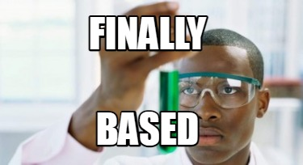

<div align="center">
  
</div>

<p style="text-align:center">The Based Stack</p>

`Based` is the ultimate stack for web frontend development!

This stack is made of 3 main technologies:

+ [HTML](https://developer.mozilla.org/en-US/docs/Web/HTML): also know as the super hot HyperText Markup Language
+ [CSS](https://developer.mozilla.org/en-US/docs/Web/CSS): the most used technology for styling web apps
+ [JavaScript](https://developer.mozilla.org/en-US/docs/Web/JavaScript): for many, the best programming language in the world

I know, right? Completely *based*!

<div align="center">
  
</div>

## Why based?

You don't need React, Angular or Vue to build a simple website. Keep it simple, stupid!

## Prerequisites

+ [node](https://nodejs.org/en/download/package-manager) (any version)

## Getting started

Run the command below to start a new based web app:

```console
$ npm based <project-name>
```

Ater that, the file tree of your project should look like this:

```
<project-name>
├── assets
│   └── img
├── css
│   └── styles.css
├── index.html
└── js
    └── scripts.js
```

> [!NOTE]  
> This is a work in progress